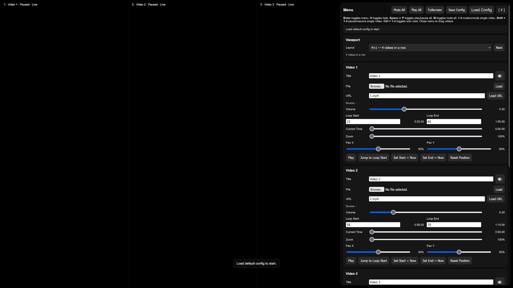
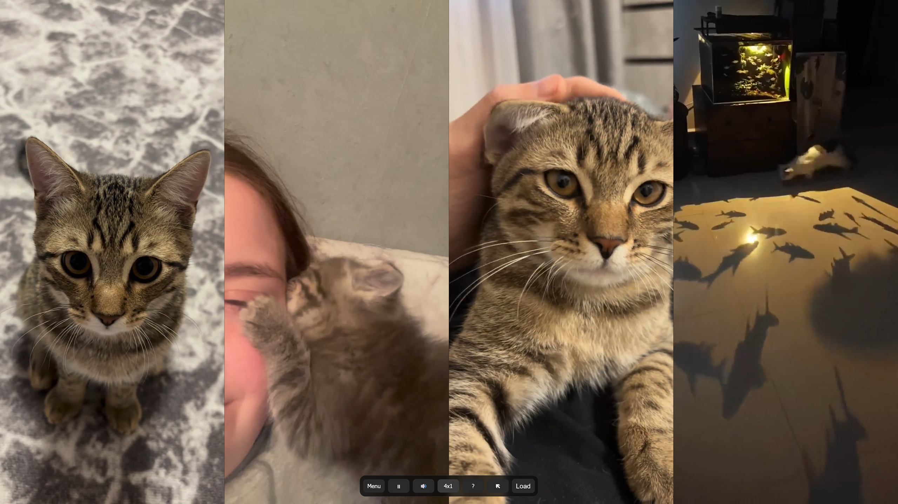

# 4 Video Wall

A browser-based 4-video wall player with per-video loop controls, volume control, solo mode, layout switching, fullscreen support, keyboard shortcuts, config save/load, and a HUD for live adjustments.

## Features

- 4 simultaneous video panels
- Two layouts:
  - `4x1`
  - `2x2`
- Per-video controls:
  - title
  - source via URL
  - source via local file
  - volume
  - mute / unmute
  - loop start / loop end
  - seek / current time
  - play / pause
  - toggle solo mode
- Global controls:
  - mute / unmute all
  - pause / play all
  - fullscreen
  - layout toggle
- Quick action bar when HUD is hidden
- Help overlay
- Save / load JSON configs
- Toast messages and action overlay feedback
- Local-file aware config restore behavior

---

## Preview / Use Case

This project is intended for installations, visual walls, live performance setups, moodboards, editing previews, exhibition displays, or any setup where multiple videos need to run in sync-like independent loop windows inside a browser.

## Screenshots

  
  
  

---

## Project Structure

```text
├─ index.html
├─ configs/
│  └─ default.json
├─ css/
│  └─ style.css
└─ js/
   └─ script.js
````

---

## Controls

### Keyboard Shortcuts

| Key               | Action                         |
| ----------------- | ------------------------------ |
| `Enter`           | Toggle menu / HUD              |
| `H`               | Toggle help overlay            |
| `Space` / `P`     | Pause / resume all videos      |
| `M`               | Mute / unmute all videos       |
| `1` - `4`         | Mute / unmute video 1-4        |
| `Shift + 1` - `4` | Pause / resume video 1-4       |
| `Ctrl + 1` - `4`  | Toggle solo mode for video 1-4 |
| `L`               | Switch layout                  |
| `Esc`             | Exit solo mode                 |

### Mouse Behavior

* Moving the mouse while the HUD is hidden shows the quick action bar.
* Clicking on a video while the HUD is visible hides the HUD.

---

## HUD / Interface

The HUD contains:

* global action buttons
* current status area
* viewport layout selector
* individual controls for each video

Each video block includes:

* editable title
* local file loader
* URL loader
* source status
* volume slider
* loop start / loop end in one row
* current time slider
* current playback time with total duration in brackets
* play / pause button
* jump to loop start
* set loop start to current position
* set loop end to current position
* icon-only mute toggle button

---

## Solo Mode

Solo mode shows only one selected video.

Behavior:

* `Ctrl + 1-4` activates solo mode for the selected video
* pressing the same shortcut again toggles solo mode off
* when solo mode is cleared, all videos resume playback
* in solo mode, the visible video uses the maximum available **height**, not width

---

## Layout Modes

### `4x1`

One row with four videos.

### `2x2`

Two rows with two videos each.

---

## Playback Behavior

* Videos do **not** start muted by default
* each video uses its configured `volume`
* loop playback is controlled manually through `loopStart` and `loopEnd`
* when a video reaches `loopEnd`, it jumps back to `loopStart`

Note: browser autoplay behavior depends on user interaction policies. Playback is unlocked on first pointer/key interaction.

---

## Config Save / Load

The app can export and import a JSON configuration file.

### Saved in config

* config version
* config name
* layout mode
* export timestamp
* per video:

  * id
  * title
  * source mode
  * source value
  * source file name
  * loop start
  * loop end
  * volume
  * muted state

### Important limitation for local files

If a video source was chosen via a local file picker, the browser cannot automatically restore that file after reload for security reasons.

That means:

* the config remembers that a local file was used
* the file name can be shown again
* but the user must manually re-select the file

---

## Example Config Format

```json
{
  "version": 2,
  "name": "My Video Wall",
  "layoutMode": "4x1",
  "exportedAt": "2026-03-22T09:07:58.264Z",
  "videos": [
    {
      "id": "video1",
      "title": "Video 1",
      "sourceMode": "url",
      "sourceValue": "https://example.com/video.mp4",
      "sourceFileName": "",
      "loopStart": 0,
      "loopEnd": 10,
      "volume": 1.0,
      "muted": true
    },
    {
      "id": "video2",
      "title": "Video 2",
      "sourceMode": "url",
      "sourceValue": "2.mp4",
      "sourceFileName": "",
      "loopStart": 0,
      "loopEnd": 10,
      "volume": 1.0,
      "muted": true
    },
    {
      "id": "video3",
      "title": "Video 3",
      "sourceMode": "url",
      "sourceValue": "clips/3.mp4",
      "sourceFileName": "",
      "loopStart": 0,
      "loopEnd": 10,
      "volume": 1.0,
      "muted": true
    },
    {
      "id": "video4",
      "title": "Video 4",
      "sourceMode": "url",
      "sourceValue": "4.mp4",
      "sourceFileName": "",
      "loopStart": 0,
      "loopEnd": 10,
      "volume": 1.0,
      "muted": true
    }
  ]
}
```

---

## Source Modes

Each video supports two source types:

### URL source

Examples:

* relative file path: `1.mp4`
* project subfolder path: `media/clip.mp4`
* remote URL: `https://example.com/video.mp4`

### Local file source

Use the file picker in the HUD and load the selected file into the corresponding video panel.

---

## Styling Notes

The layout is based on CSS Grid.

Relevant visual systems:

* fullscreen video wall
* HUD panel
* help overlay
* quick action bar
* toast notifications
* central action icon overlay
* solo mode styling
* responsive loop input layout for small screens

---

## Responsive Behavior

On smaller screens:

* loop start / end fields stack vertically
* HUD remains scrollable
* quick bar stays compact and centered

---

## Browser Notes

Best tested in modern Chromium-based browsers and Firefox.

Things that may vary by browser:

* autoplay permissions
* fullscreen handling
* file URL behavior
* codec support for MP4 / WebM / other video formats

---

## Customization

Common changes you can make in `js/script.js`:

* change default video files
* change default loop points
* change default volume values
* change default layout
* change keyboard shortcuts
* add more metadata per video
* extend config structure

Common changes in `css/style.css`:

* HUD styling
* solo mode sizing
* labels
* overlay behavior
* quick bar appearance
* responsive breakpoints

---

## Known Limitations

* Local files cannot be restored automatically from saved config
* Browser autoplay restrictions may require a user interaction first
* Synchronization is visual/manual, not frame-accurate across videos
* Supported playback depends on browser codec support

---

## License

GNU GENERAL PUBLIC LICENSE Version 3
