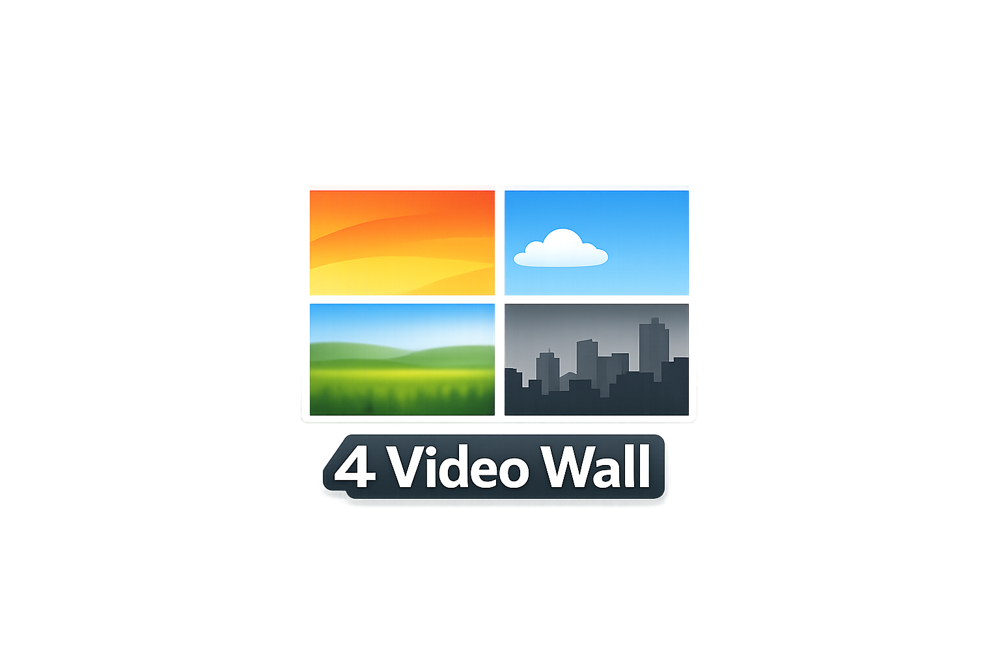

[Desktop app version (Windows)](https://drive.google.com/drive/folders/1R1BZmtSfM-5gCfLMulFZyMyiz9kh-R2E?usp=sharing)

A browser-based 4-video wall player for up to four simultaneous videos, with independent looping, per-video audio, speed, pan, zoom, filters, fade-to-video and optional fade-to-audio, drag-and-drop panel reordering, solo mode, layout switching, fullscreen, keyboard shortcuts, JSON config save/load, editable title/label CSS, and a live HUD.

## Features

- Up to 4 simultaneous video panels
- Layouts: `4x1`, `2x2`, `2x1-left`, `2x1-right`
- Adjustable grid gap (`0–32px`)
- Many per-video controls
- Global controls:
  - play / pause all
  - mute / unmute all
  - global playback speed with presets
  - layout switching
  - fullscreen
  - desktop app exit button
- Viewport controls:
  - wall title text
  - optional centered wall title overlay
  - editable CSS for wall title and clip labels
- Solo mode per video
- Panel order controls:
  - drag-and-drop reordering via viewport panel icons
  - reordered presentation is reflected in both viewport and HUD control order
- Hidden-HUD interaction:
  - drag to pan
  - scroll to zoom
  - quick action bar
- Help overlay
- Save / load JSON configs
- Config persistence for settings
- Local-file aware restore behavior

---

## Preview / Use Case

Designed for installations, visual walls, live performance setups, moodboards, editing previews, exhibition displays, and other browser-based multi-video setups.

## Screenshots


---

## Project Structure

```text
├─ index.html
├─ server.py
├─ server.bat
├─ configs/
│  └─ default.json
├─ css/
│  └─ style.css
├─ img/
│  ├─ slpashscreen.png
│  ├─ screenshot_hud.png
│  ├─ screenshot_layout1.png
│  ├─ screenshot_layout2.png
│  └─ screenshot_layout3.png
└─ js/
   └─ script.js
````

## Usage

* For local files, serve the project through a local web server. Opening `index.html` via `file:///` will usually block local file loading due to browser security restrictions.
* If you only use URLs, opening `index.html` directly is enough.
* You can also download the [Desktop app version (Windows)](https://drive.google.com/drive/folders/1R1BZmtSfM-5gCfLMulFZyMyiz9kh-R2E?usp=sharing) from google drive

### Quick start with Python

Download project files, use cmd to enter the folder and run:

```bash
python -m http.server 8080
```

Then open [http://localhost:8080](http://localhost:8080).

### Extended Python server (optional — auto-download clips)

If you want URLs entered in the HUD to be **automatically downloaded and saved to `/clips`** before playback, use the included `server.py` instead:

```bash
python server.py
```

Then open [http://localhost:8000](http://localhost:8000).

When a URL is loaded via the HUD, the server downloads the file to `./clips/` and the player uses the local copy. If the server is not running, the URL is loaded directly as usual — no functionality is lost.

---

## Controls

### Keyboard Shortcuts

| Key                 | Action                                           |
| ------------------- | ------------------------------------------------ |
| `Enter`             | Toggle HUD                                       |
| `Space` / `P`       | Pause / resume all                               |
| `1` - `4`           | Mute / unmute video 1-4                          |
| `Shift` + `1` - `4` | Pause / resume video 1-4                         |
| `Ctrl` + `1` - `4`  | Toggle solo mode for video 1-4                   |
| `Alt` + `1` - `4`   | Show only first N panels; press again to restore |
| `H`                 | Toggle help overlay                              |
| `M`                 | Mute / unmute all                                |
| `L`                 | Cycle layout                                     |
| `Esc`               | Exit solo mode                                   |
| `Ctrl` + `Q`        | Exit desktop app                                 |
| Any key             | Dismiss splash screen                            |

### Mouse Behavior (HUD hidden)

| Action       | Effect                           |
| ------------ | -------------------------------- |
| Click        | Unlock playback / dismiss splash |
| Move mouse   | Show quick action bar            |
| Drag         | Pan video inside its cell        |
| Scroll       | Zoom (`100–300%`)                |
| Double-click | Reset pan and zoom               |

### HUD Drag-and-Drop Behavior

| Action                          | Effect                                                     |
| ------------------------------- | ---------------------------------------------------------- |
| Drag panel icon in viewport HUD | Reorder panel presentation order                           |
| Drop panel icon between others  | Insert panel at the dropped position                       |
| Click panel icon `1–4`          | Show first N panels in current order                       |
| Reorder panels                  | Reorders both viewport cells and the matching HUD sections |

---

## Interface

The HUD contains global controls plus one control block per video.

Each video block includes:

* title and source loading (URL or local file)
* optional clip label toggle
* source status
* volume
* audio offset
* playback speed with presets
* loop start / end
* seek bar and time readout
* zoom
* pan X / pan Y
* play / pause
* jump/set loop controls
* mute toggle
* fade mode and fade timings
* optional audio fade toggle
* filter toggle with collapsible filter panel
* filter reset
* brightness, contrast, saturation, grayscale

The viewport block includes:

* wall title text
* wall title visibility toggle
* layout selector and next-layout button
* panel order / panel visibility icons
* grid gap
* autoplay toggle
* global playback speed with presets
* collapsible font / CSS editor for:

  * wall title CSS
  * clip label CSS

---

## Behavior

### Startup Splash Screen

On launch, the app shows a fullscreen splash image from `img/slpashscreen.png`.

* closes on any key press
* closes on click anywhere
* closes automatically after 5 seconds
* also unlocks playback on dismissal

This is useful for installations and kiosk-style startup presentation.

### Layouts

The player supports four layouts:

* `4x1` — one row, four videos
* `2x2` — two rows, two videos each
* `2x1-left` — videos 1-2 side by side on the left, videos 3-4 stacked on the right
* `2x1-right` — videos 1-2 stacked on the left, videos 3-4 side by side on the right

`L`, the HUD selector, and the quick bar all switch or reflect the current layout.

### Panel Ordering / Drag and Drop

The HUD viewport section contains panel icons `1–4`.

* clicking an icon shows the first `N` panels in the **current order**
* dragging one icon horizontally onto another position reorders the presentation
* the reorder affects:

  * viewport panel order
  * HUD video-control block order
  * visible-panel logic (`show first N`)
  * saved config panel order
* labels are refreshed after reordering so numbering always matches the current presentation order

This makes it possible to create a different visual sequence without changing the underlying video IDs.

### Solo Mode

Solo mode shows one selected video centered with `object-fit: contain`.

* toggled with `Ctrl` + `1`-`4`
* pressing the same shortcut again disables it
* `Esc` exits solo mode
* pan/zoom are preserved but visually ignored while solo mode is active
* when solo mode ends, pan/zoom resume as previously configured
* when solo mode is cleared, all videos resume playback

### Active Panel Count

`Alt` + `1`-`4` limits the wall to the first `1–4` visible panels.

* pressing the same shortcut again restores all four
* hidden panels keep their playback state, loop points, volume, speed, audio offset, pan, zoom, filters, and fade settings
* visible panels expand to fill the available width
* the normal layout is temporarily overridden while panel count mode is active
* because the feature always shows the **first N panels in current order**, drag-and-drop reordering directly affects which panels are shown

### Playback

* videos do **not** start muted by default
* each video uses its configured volume and playback rate
* audio playback is handled separately from the visible video element so audio offset can be applied independently
* `audioOffset` shifts audio timing relative to the visible video:

  * positive values delay audio
  * negative values advance audio
  * `0` keeps audio aligned to the visible video timeline
* audio offset is applied during normal playback, seeking, pause/resume, manual loop transitions, and source reloads
* full-length playback can use the full media duration when no custom loop end is defined
* custom looping is handled through `loopStart` and `loopEnd`
* reaching `loopEnd` returns playback to `loopStart` and re-synchronizes the audio timeline to the active loop segment
* playback rate is re-applied after source changes to avoid browser reset behavior
* autoplay still depends on browser interaction policies and is unlocked on first pointer/key interaction

### Fade Settings

Each video supports independent fade transitions.

Fade parameters:

* `fadeMode`

  * `none`
  * `black`
  * `white`
* `fadeIn`
* `fadeOut`
* `fadeAudio`

Behavior:

* fade timings are normalized against the active playback segment
* if a custom loop is defined, fade limits are based on the loop segment:

  * `loopStart → loopEnd`
* if no custom loop is defined, fade limits are based on the full video duration
* fade-in happens at the start of the active segment
* fade-out happens at the end of the active segment
* fade overlay color is black or white depending on the selected fade mode
* fade status text in the HUD shows whether the current bounds are based on:

  * full video duration
  * or the loop segment
* optional audio fade applies the same fade curve to the audio level
* audio fading is multiplied against the current configured clip volume rather than replacing it

This allows clips to fade cleanly within a custom loop window instead of only against the full media duration.

### Wall Title and Clip Labels

The app supports two independent text overlays:

* **wall title**:

  * edited in the viewport section
  * optionally shown centered at the top of the screen
* **clip labels**:

  * toggled individually per clip
  * still also shown when the HUD is open

Both title and label styling are controlled through editable CSS text fields in the viewport section.

Default styling uses:

* sans-serif font
* white text
* black outline / stroke effect

The custom CSS is saved in config files and restored on load.

---

## Config Save / Load

The app can export and import JSON configs.

Saved data includes all settings (viewport + individual video cell settings).

---

## Known Limitations

* Local files cannot be restored automatically from saved configs
* Browser autoplay restrictions may require user interaction first
* Synchronization is visual/manual, not frame-accurate across multiple independent videos
* Audio offset is designed for practical browser playback, not frame-accurate editorial sync
* Supported playback-rate range depends on browser and codec support
* Pan/zoom have no visible effect in solo mode, but remain preserved
* Active panel count temporarily overrides the selected layout until cleared
* Filter rendering depends on browser support, though modern Chromium-based browsers and Firefox generally work well
* Fade smoothness at loop boundaries depends on browser seek/render timing and the exact transition strategy used in the current implementation
* CSS text styling for wall title / labels is applied directly, so invalid CSS snippets can break the intended appearance until edited again
* `-webkit-text-stroke` support may vary slightly across browsers

---

## License

GNU GENERAL PUBLIC LICENSE Version 3
