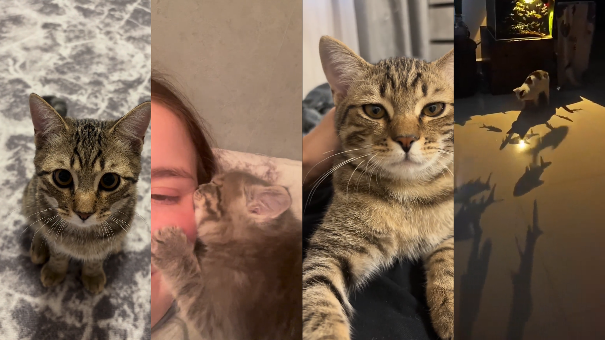
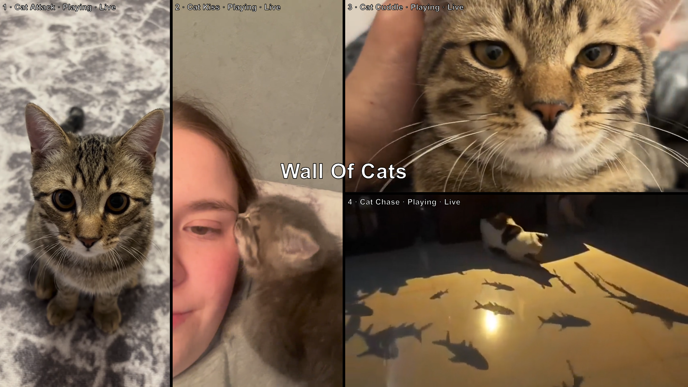

# 4 Video Wall

A browser-based 4-video wall player with per-video loop controls, volume control, playback speed, pan and zoom, per-video filter controls, solo mode, layout switching, adjustable grid gap, fullscreen support, keyboard shortcuts, config save/load, and a HUD for live adjustments.

## Features

- Up to 4 simultaneous video panels
- Four layouts:
  - `4x1`
  - `2x2`
  - `2x1-left`
  - `2x1-right`
- Adjustable grid gap (`0–32px`)
- Per-video controls:
  - title
  - source via URL
  - source via local file
  - volume
  - mute / unmute
  - playback speed (0.25×–4×) with preset buttons
  - loop start / loop end
  - seek / current time
  - play / pause
  - pan X / pan Y
  - zoom (100–300%)
  - filter panel with:
    - brightness (0–200%)
    - contrast (0–200%)
    - saturation (0–200%)
    - grayscale (0–100%)
  - dedicated filter reset button
- Global controls:
  - mute / unmute all
  - pause / play all
  - global playback speed with preset buttons
  - fullscreen
  - layout toggle
- Solo mode per video (centered, pan/zoom ignored)
- Active panel count (show first 1–4 panels)
- Drag to pan and scroll to zoom when HUD is hidden
- Quick action bar when HUD is hidden
- Save / load JSON configs
- Toast messages and action overlay feedback
- Local-file aware config restore behavior
- Config persistence for layout gap and per-video filter values
- Help overlay

---

## Preview / Use Case

This project is intended for installations, visual walls, live performance setups, moodboards, editing previews, exhibition displays, or any setup where multiple videos need to run in sync-like independent loop windows inside a browser.

## Screenshots

  
  
  
  
  
  
  

---

## Project Structure

```text
├─ index.html
├─ configs/
│  └─ default.json
├─ css/
│  └─ style.css
└─ js/
   └─ script.js
```

## Usage

If using local files, this project must be served via a local web server — opening `index.html` directly as a `file:///` URL will block local file loading due to browser security restrictions.  
If only using URLs, just open index.html in your browser.

### Quick start with Python

```bash
python -m http.server 8080
```

Then open [http://localhost:8080](http://localhost:8080) in your browser.

---

## Controls

### Keyboard Shortcuts

| Key               | Action                                            |
| ----------------- | ------------------------------------------------- |
| `Enter`           | Toggle menu / HUD                                 |
| `H`               | Toggle help overlay                               |
| `Space` / `P`     | Pause / resume all videos                         |
| `M`               | Mute / unmute all videos                          |
| `1` - `4`         | Mute / unmute video 1-4                           |
| `Shift` + `1` - `4` | Pause / resume video 1-4                          |
| `Ctrl` + `1` - `4`  | Toggle solo mode for video 1-4                    |
| `Alt` + `1` - `4`   | Show only first N panels (press again to restore) |
| `L`               | Cycle to next layout                              |
| `Esc`             | Exit solo mode                                    |

### Mouse Behavior (HUD hidden)

| Action         | Effect                                |
| -------------- | ------------------------------------- |
| Move mouse     | Show quick action bar                 |
| Drag           | Pan video within its cell             |
| Scroll         | Zoom video within its cell (100–300%) |
| Double-click   | Reset pan and zoom to default         |

---

## HUD / Interface

The HUD contains:

* global action buttons
* current status area
* viewport layout selector
* viewport gap / border slider (`0–32px`)
* global playback speed slider with preset buttons
* individual controls for each video

Each video block includes:

* editable title
* local file loader
* URL loader
* source status
* volume slider
* playback speed slider (0.25×–4×) with preset buttons
* loop start / loop end in one row
* current time slider
* current playback time with total duration in brackets
* zoom slider (100–300%)
* pan X / pan Y sliders
* play / pause button
* jump to loop start
* set loop start to current position
* set loop end to current position
* reset pan and zoom
* icon-only 🔊 mute toggle button
* icon-only 🎨 filter button next to the mute button in the title row
* collapsible filter panel per video
* filter reset button in the filter panel header
* brightness slider (0–200%)
* contrast slider (0–200%)
* saturation slider (0–200%)
* grayscale slider (0–100%)

---

## Solo Mode

Solo mode shows only one selected video, centered and letter/pillarboxed.

Behavior:

* `Ctrl` + `1`-`4` activates solo mode for the selected video
* pressing the same shortcut again toggles solo mode off
* when solo mode is cleared, all videos resume playback
* in solo mode, the visible video uses `object-fit: contain` to fill the available space without cropping
* pan and zoom values for the video are preserved in the background but do not affect solo view — the video is always centered cleanly at its natural aspect ratio
* pan and zoom resume as configured when solo mode is exited

---

## Active Panel Count

The active panel count controls how many video panels are shown at once without entering solo mode.

Behavior:

* `Alt` + `1` shows only the first panel
* `Alt` + `2` shows only the first two panels
* `Alt` + `3` shows only the first three panels
* `Alt` + `4` shows all four panels
* pressing the same key again restores all four panels
* hidden panels are only visually hidden — all video state, loop points, volume, speed, pan, and zoom settings are preserved
* the visible panels expand to fill the full screen width
* the active layout mode is temporarily overridden to a simple single-row grid for the visible panels

---

## Playback Speed

Each video has an independent playback speed control.

Behavior:

* speed range is 0.25× to 4×
* a slider and a row of preset buttons (0.25×, 0.5×, 0.75×, 1×, 1.25×, 1.5×, 2×, 4×) are available per video
* the global speed control in the Viewport section of the HUD sets all videos to the same speed simultaneously
* speed is preserved across config save and load
* speed is re-applied automatically after source changes to prevent browser reset behavior

---

## Layout Modes

Pressing `L` cycles through all four layouts in order. The layout selector in the HUD and the quick bar button both reflect the current mode.

### `4x1`

One row with four videos side by side at full height.

```
| V1 | V2 | V3 | V4 |
```

### `2x2`

Two rows with two videos each.

```
| V1 | V2 |
| V3 | V4 |
```

### `2x1-left`

Left half: videos 1 and 2 side by side at full height. Right half: videos 3 and 4 stacked.

```
| V1 | V2 |   V3   |
|    |    |   V4   |
```

### `2x1-right`

Left half: videos 1 and 2 stacked. Right half: videos 3 and 4 side by side at full height.

```
|   V1   | V3 | V4 |
|   V2   |    |    |
```

---

## Playback Behavior

* Videos do **not** start muted by default
* each video uses its configured `volume`
* each video uses its configured `playbackRate`
* loop playback is controlled manually through `loopStart` and `loopEnd`
* when a video reaches `loopEnd`, it jumps back to `loopStart`

Note: browser autoplay behavior depends on user interaction policies. Playback is unlocked on first pointer/key interaction.

---

## Config Save / Load

The app can export and import a JSON configuration file.

### Saved in config

* config version
* config name
* layout mode
* grid gap
* export timestamp
* per video:

  * id
  * title
  * source mode
  * source value
  * source file name
  * loop start
  * loop end
  * volume
  * playback rate
  * muted state
  * pan X
  * pan Y
  * zoom
  * brightness
  * contrast
  * saturation
  * grayscale

### Version notes

* config format version is now `5`
* `gridGap` is stored globally
* filter values are stored per video
* on config load, the saved grid gap is restored and synchronized back into the HUD slider
* on config load, all saved filter values are restored per video

### Important limitation for local files

If a video source was chosen via a local file picker, the browser cannot automatically restore that file after reload for security reasons.

That means:

* the config remembers that a local file was used
* the file name can be shown again
* but the user must manually re-select the file

---

## Example Config Format

```json
{
  "version": 5,
  "name": "Wall Of Cats",
  "layoutMode": "2x2",
  "gridGap": 14,
  "exportedAt": "2026-03-28T10:41:37.367Z",
  "videos": [
    {
      "id": "video1",
      "title": "Window Watch",
      "sourceMode": "url",
      "sourceValue": "https://interactive-examples.mdn.mozilla.net/media/cc0-videos/flower.mp4",
      "sourceFileName": "",
      "loopStart": 0,
      "loopEnd": 6.5,
      "volume": 0.25,
      "playbackRate": 1,
      "muted": false,
      "panX": 42,
      "panY": 56,
      "zoom": 112,
      "brightness": 108,
      "contrast": 104,
      "saturation": 118,
      "grayscale": 0
    },
    {
      "id": "video2",
      "title": "Soft Landing",
      "sourceMode": "url",
      "sourceValue": "https://storage.googleapis.com/gtv-videos-bucket/sample/ForBiggerJoyrides.mp4",
      "sourceFileName": "",
      "loopStart": 3,
      "loopEnd": 15.2,
      "volume": 0.8,
      "playbackRate": 1,
      "muted": false,
      "panX": 61,
      "panY": 47,
      "zoom": 105,
      "brightness": 96,
      "contrast": 112,
      "saturation": 106,
      "grayscale": 8
    },
    {
      "id": "video3",
      "title": "Quiet Patrol",
      "sourceMode": "url",
      "sourceValue": "https://storage.googleapis.com/gtv-videos-bucket/sample/BigBuckBunny.mp4",
      "sourceFileName": "",
      "loopStart": 12,
      "loopEnd": 24,
      "volume": 0.5,
      "playbackRate": 0.75,
      "muted": false,
      "panX": 38,
      "panY": 63,
      "zoom": 120,
      "brightness": 102,
      "contrast": 98,
      "saturation": 92,
      "grayscale": 18
    },
    {
      "id": "video4",
      "title": "Late Night Zoomies",
      "sourceMode": "url",
      "sourceValue": "https://storage.googleapis.com/gtv-videos-bucket/sample/ElephantsDream.mp4",
      "sourceFileName": "",
      "loopStart": 5,
      "loopEnd": 17.5,
      "volume": 0.65,
      "playbackRate": 1.25,
      "muted": false,
      "panX": 54,
      "panY": 41,
      "zoom": 110,
      "brightness": 115,
      "contrast": 121,
      "saturation": 128,
      "grayscale": 0
    }
  ]
}
```

---

## Source Modes

Each video supports two source types:

### URL source

Examples:

* relative file path: `1.mp4`
* project subfolder path: `media/clip.mp4`
* remote URL: `https://example.com/video.mp4`

### Local file source

Use the file picker in the HUD and load the selected file into the corresponding video panel.

---

## Styling Notes

The layout is based on CSS Grid.

Relevant visual systems:

* fullscreen video wall
* HUD panel
* help overlay
* quick action bar
* toast notifications
* central action icon overlay
* solo mode styling (centered, contain-fit, pan/zoom neutralized)
* active panel count grid overrides
* speed preset button row
* collapsible per-video filter panel
* active-state styling for the 🎨 button
* grid gap spacing applied directly on the wall container
* responsive loop and pan input layout for small screens

---

## Responsive Behavior

On smaller screens:

* loop start / end fields stack vertically
* pan X / pan Y fields stack vertically
* filter controls stack naturally within each video block
* HUD remains scrollable
* quick bar stays compact and centered

---

## Browser Notes

Best tested in modern Chromium-based browsers and Firefox.

Things that may vary by browser:

* autoplay permissions
* fullscreen handling
* file URL behavior
* codec support for MP4 / WebM / other video formats
* supported playback rate range (most browsers support 0.25×–4×; some allow higher values)

---

## Customization

Common changes you can make in `js/script.js`:

* change default video files
* change default loop points
* change default volume values
* change default playback speed
* change default filter values
* change the speed preset values in the `SPEED_PRESETS` array
* change default layout
* change default grid gap
* change keyboard shortcuts
* add more metadata per video
* extend config structure
* add or reorder layout modes via the `LAYOUT_MODES` array

Common changes in `css/style.css`:

* HUD styling
* solo mode sizing
* labels
* overlay behavior
* quick bar appearance
* responsive breakpoints
* grid definitions for custom layout modes
* active panel count grid overrides
* filter panel appearance
* active 🎨 button styling
* grid gap related spacing

---

## Known Limitations

* Local files cannot be restored automatically from saved config
* Browser autoplay restrictions may require a user interaction first
* Synchronization is visual/manual, not frame-accurate across videos
* Supported playback rate range depends on browser codec support
* If panning a video does not work as intended after changing the layout, use zoom or double click to reset
* Pan and zoom have no visible effect while a video is in solo mode — they are preserved and resume when solo mode is exited
* Active panel count (`Alt` + `1`–`4`) overrides the current layout grid temporarily; switching layouts while a panel count is active will take effect once the panel count is cleared
* Filter rendering depends on browser support for CSS/video filter pipelines, but modern Chromium-based browsers and Firefox generally handle this well

---

## License

GNU GENERAL PUBLIC LICENSE Version 3
